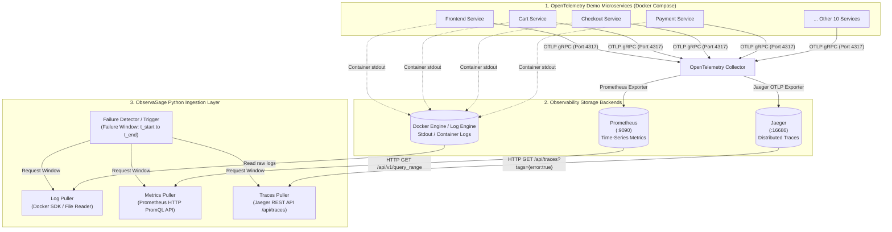
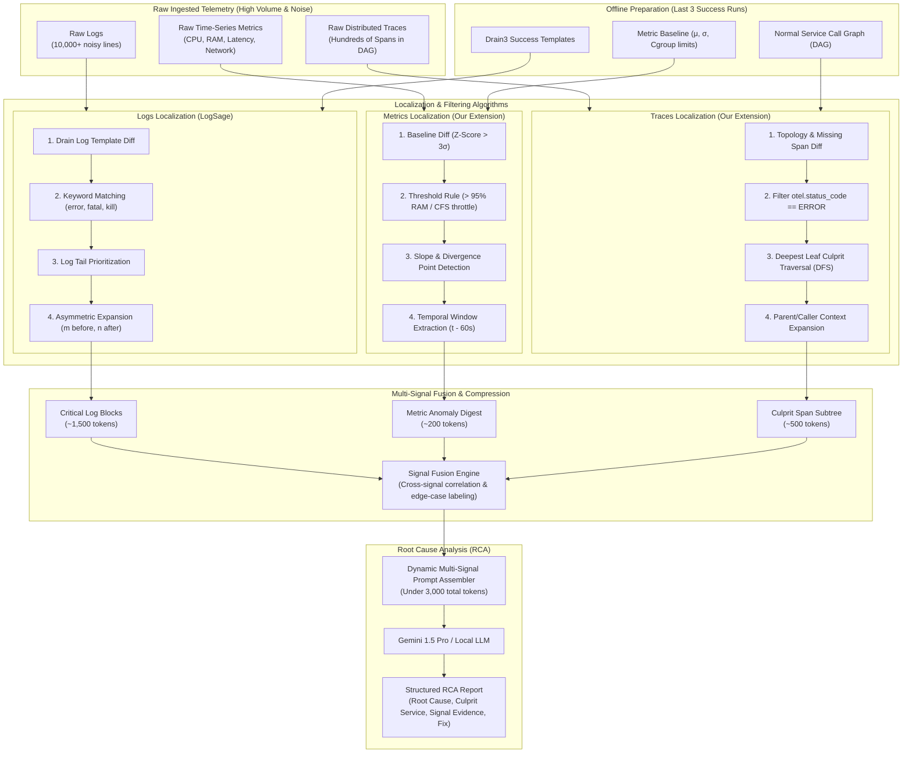
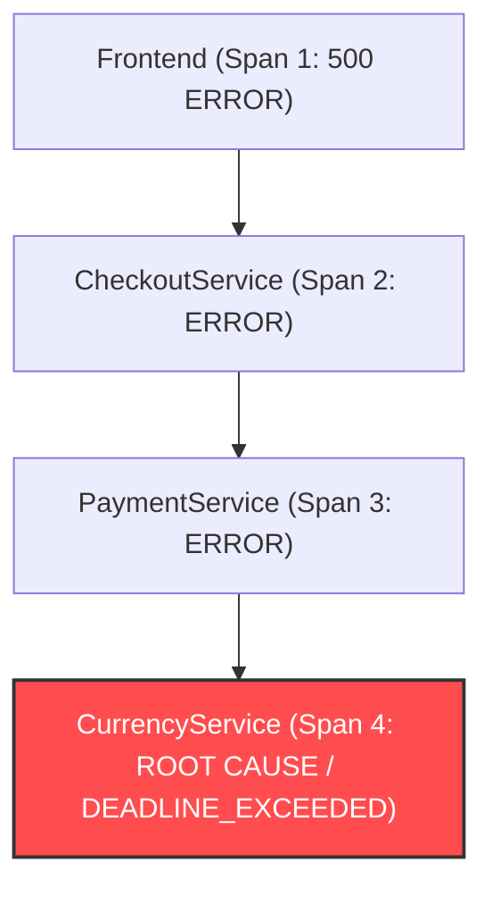

# ObservaSage: Multi-Signal CI/CD Root Cause Analysis Framework
### Extending LogSage (arXiv:2506.03691) with Logs, Metrics, and Distributed Traces

---

## 1. Executive Summary

Continuous Integration and Continuous Deployment (CI/CD) pipelines and microservice architectures are prone to complex, recurring failures. 

In the baseline paper **LogSage** (*"LogSage: An LLM-Based Framework for CI/CD Failure Detection and Remediation with Industrial Validation"*, arXiv:2506.03691, ByteDance & ECNU, 2025), failure diagnosis is performed **exclusively using raw execution logs**. While LogSage achieves >98% precision on standard log-heavy failures, relying solely on logs leaves blind spots for failures where log data is missing, truncated, identical to passing runs, or decoupled from the actual root-cause service.

**ObservaSage** extends LogSage across the **three pillars of observability**:
1. **Logs**: Contextual text output (retaining LogSage's Drain template diff and keyword pruning).
2. **Metrics**: Time-series telemetry (CPU, memory RSS, network I/O, latency distributions).
3. **Traces**: Distributed request DAGs (OpenTelemetry spans, error status codes, latency bottlenecks).

By fusing logs, metrics, and traces into a token-efficient diagnostic prompt for Large Language Models (Gemini / local LLMs), ObservaSage solves critical edge cases that log-only approaches cannot diagnose.

---

## 2. The 5 Edge Cases: Why Logs Fail & How Metrics + Traces Solve Them

| Edge Case | Failure Mode | Why Logs Fail (LogSage Blind Spot) | How Metrics & Traces Solve It |
|---|---|---|---|
| **EC-1: OOM / Resource Kill** | Container killed by Linux cgroup OOM-killer (`exit code 137`). | Process dies instantly mid-write; log is truncated or has 0 error messages. | **Metrics**: Prometheus memory gauge (`container_memory_rss`) reveals monotonic upward slope reaching 100% of cgroup limit right before termination. |
| **EC-2: Flaky / Intermittent Latency** | Pipeline step fails intermittently due to downstream timeout. | Logs between passing and failing runs are *identical* or generic (`timeout reached`). Log diff finds no candidates. | **Metrics & Traces**: Latency metric (p99) spikes; Jaeger trace shows exact downstream dependency span timing out. |
| **EC-3: Cascading Microservice Failure** | A downstream microservice crashes; upstream services fail consecutively. | The failing service logs a generic `500 Internal Error` or `Connection Refused`. The actual crashed service is on a completely different pod/log file. | **Traces**: DFS traversal on the span tree identifies the deepest leaf span with `otel.status_code == ERROR`, pinpointing the root culprit service. |
| **EC-4: Silent Data Corruption** | Pipeline passes with `exit code 0`, but output artifact is corrupted or empty. | Zero `ERROR` or `FATAL` log lines are emitted. LogSage treats this as a clean, passing execution. | **Metrics**: Data assertions and metric checks (output byte size anomaly, record count Z-score deviation) trigger detection. |
| **EC-5: Infrastructure Drift / Node Eviction** | Kubernetes node eviction, CPU CFS throttling, or network partition. | Application logs show vague network timeouts without revealing infrastructure issues. | **Metrics**: Node-level metrics (`container_cpu_cfs_throttled_periods_total`, network drop errors) expose the infra cause. |

---

## 3. System Architecture & Data Extraction Flow

The target environment is the official **OpenTelemetry Astronomy Shop Demo** (14 microservices instrumented with OpenTelemetry SDKs). The telemetry flows through the **OpenTelemetry Collector** into dedicated backends (**Prometheus**, **Jaeger**, **Docker logs**), where our Python ingestion layer retrieves failure snapshots.



### Step-by-Step Telemetry Extraction Process

1. **Failure Trigger**:
   When a CI/CD job or test execution fails, the system establishes a precise temporal failure window:
   $$W = [T_{\text{start}} - 30\text{s},\; T_{\text{end}} + 10\text{s}]$$
   along with pipeline metadata (target service, run ID, exit code).

2. **Pulling Logs (Docker SDK)**:
   ```python
   import docker
   client = docker.from_env()
   container = client.containers.get("checkoutservice")
   raw_logs = container.logs(
       since=int(t_start.timestamp()),
       until=int(t_end.timestamp())
   ).decode("utf-8")
   ```

3. **Pulling Metrics (Prometheus HTTP API)**:
   ```python
   import requests
   prom_url = "http://localhost:9090/api/v1/query_range"
   query = 'container_memory_working_set_bytes{name=~".*checkoutservice.*"}'
   response = requests.get(prom_url, params={
       'query': query,
       'start': t_start.isoformat(),
       'end': t_end.isoformat(),
       'step': '5s'
   })
   metrics_data = response.json()['data']['result']
   ```

4. **Pulling Traces (Jaeger REST API)**:
   ```python
   jaeger_url = "http://localhost:16686/api/traces"
   params = {
       "service": "checkoutservice",
       "start": int(t_start.timestamp() * 1_000_000),  # microseconds
       "end": int(t_end.timestamp() * 1_000_000),
       "tags": '{"error":"true"}'                      # only traces with error spans
   }
   trace_data = requests.get(jaeger_url, params=params).json()['data']
   ```

---

## 4. Signal Localization & Pruning Pipeline

Raw logs, metrics, and traces are massive in volume. Feeding them directly to an LLM leads to context dilution, hallucinations, and high latency. 

ObservaSage designs **signal-specific localization algorithms** that prune out noise and extract only high-density evidence blocks, keeping the overall prompt within ~2,500 tokens.



---

## 5. Algorithmic Comparison: How Each Signal is Located

| Step | Logs (LogSage Baseline) | Metrics (ObservaSage Extension) | Traces (ObservaSage Extension) |
|---|---|---|---|
| **1. Diff Against Success Runs** | **Drain3 Template Diff**: Filters out log templates recurring in the last $x=3$ successful runs. | **Statistical Baseline Diff**: Computes mean $\mu$ and std dev $\sigma$ over recent runs; flags metrics with $\|Z\| > 3.0$. | **Call-Graph DAG Diff**: Compares execution graph against expected trace DAG; flags missing downstream calls. |
| **2. Pattern / Anomaly Filter** | **Keyword Matching**: Scans for `fatal`, `error`, `kill`, `panic`, `cannot`, `exception`. | **Threshold Rules**: Flags memory $> 95\%$ of cgroup limit, CPU throttled periods $> 0$. | **Span Status Filter**: Filters spans where `otel.status_code == ERROR` or exceptions exist. |
| **3. Spatial/Temporal Localization** | **Tail Prioritization**: Ranks lines near EOF higher, as failures abruptly terminate execution. | **Slope & Changepoint Detection**: Finds inflection point where metric diverged before job crash. | **Deepest Culprit Search (DFS)**: Walks span error tree to find the deepest leaf node where the fault originated. |
| **4. Context Expansion** | **Asymmetric Window**: Adds $m$ lines before and $n$ lines after each key line ($n > m$). | **Temporal Context**: Preserves 60s pre-failure trend and 10s post-termination window. | **Caller/Callee Context**: Extracts the culprit span + its immediate parent caller parameters. |
| **5. Token Compression** | Token pruning to fit $\approx 18\text{k}$ tokens. | Compressed structured markdown table ($\approx 200$ tokens). | Compact JSON/text representation of the failure subtree ($\approx 500$ tokens). |

---

## 6. Deep Dive: Trace & Metric Localization Algorithms

### A. Trace Culprit Localization (Depth-First Search)

When microservices fail, errors bubble up:
`Frontend (500)` $\rightarrow$ `CheckoutService (Error)` $\rightarrow$ `PaymentService (Error)` $\rightarrow$ `CurrencyService (Timeout)`.

If an engineer only checks `Frontend` or `Checkout` logs, they misdiagnose the failure. The trace localization algorithm resolves this:



**Algorithm Logic**:
1. Build directed acyclic graph (DAG) from span `parent_span_id` relationships.
2. Filter nodes to subset $E = \{s \in \text{Spans} \mid s.\text{status} = \text{ERROR}\}$.
3. For each span $s \in E$, check its children. If no child span in $E$ exists below $s$, then $s$ is a **leaf error span** (the true origin).
4. Extract $s$ along with its parent (the caller) to obtain input arguments and error attributes (`exception.message`, `rpc.grpc.status_code`).

### B. Metric Anomaly Localization (Z-Score & Slope)

In an Out-Of-Memory (OOM) kill (`exit code 137`), application logs are cut short without any `OutOfMemoryError` stack trace.

**Algorithm Logic**:
1. Calculate Z-score over the sliding window:
   $$Z(t) = \frac{M(t) - \mu_{\text{baseline}}}{\sigma_{\text{baseline}}}$$
2. Calculate rate of memory consumption (leak gradient):
   $$\text{Slope} = \frac{\Delta M}{\Delta t}$$
3. If $M(t_{\text{end}}) \ge 0.95 \times \text{Limit}$ and $\text{Slope} > 0$, synthesize the alert:
   ```markdown
   [METRIC ALERT] OOM Kill Detected on cartservice
   - Metric: container_memory_working_set_bytes
   - Normal Baseline: 128 MB (±12 MB)
   - Peak Before Termination: 512 MB (Hit 100% Cgroup Limit)
   - Behavior: Linear climb (+8.2 MB/s) over 47s prior to exit code 137
   ```

---

## 7. Multi-Signal Prompt Assembly & LLM Output

### Fused Prompt Structure

```markdown
You are an expert DevOps SRE performing root cause analysis on a pipeline failure.

### 1. Extracted Log Evidence (Drain Template Diff):
Line 204: [cartservice] RPC failed: transport is closing
Line 205: [cartservice] terminating with exit code 137

### 2. Extracted Metric Evidence (Prometheus Anomaly Detector):
[ALERT] container_memory_working_set_bytes reached 512MB (100% limit) at 19:04:12.
Pre-termination slope: +8.2 MB/s continuous climb.

### 3. Extracted Trace Evidence (Jaeger Culprit Span):
Root Span ID: 4b89e21f9
Service: cartservice | Method: AddItem
Error: context deadline exceeded | Latency: 5002ms

### Task:
Provide a structured JSON Root Cause Analysis report with root_cause, culprit_service, 
primary_signal, edge_case_category, confidence, and recommended_fix.
```

### Structured Output Format

```json
{
  "root_cause": "The cartservice encountered an Out-Of-Memory (OOM) termination due to continuous heap allocation during AddItem requests, hitting the 512MB cgroup boundary.",
  "culprit_service": "cartservice",
  "edge_case_category": "EC-1: OOM / Resource Exhaustion",
  "primary_signal": "metrics",
  "confidence": 0.98,
  "evidence": {
    "log_line": "terminating with exit code 137",
    "metric_alert": "container_memory_working_set_bytes reached 512MB limit",
    "culprit_span_id": "4b89e21f9"
  },
  "recommended_fix": "Increase cartservice container memory limit from 512Mi to 1Gi in deployment manifest and profile memory allocations in AddItem handler."
}
```

---

## 8. Directory Structure

```
final_year_project/
├── README.md                           # Comprehensive documentation & architecture
├── docker-compose.yml                  # OpenTelemetry demo app + Prometheus + Jaeger stack
├── pyproject.toml                      # Python dependencies
├── scripts/
│   ├── inject_failures.py              # Failure injection script (OOM, Latency, Cascade, etc.)
│   ├── collect_telemetry.py            # Automated capture of logs, metrics, and traces
│   └── run_benchmark.py                # Evaluation runner for precision/recall/F1
├── src/
│   ├── log_processor/                  # LogSage log preprocessing pipeline
│   │   ├── drain_templates.py          # Drain3 template clustering
│   │   ├── key_log_filter.py           # Log diff + keyword matching + tail priority
│   │   ├── key_log_expander.py         # Asymmetric context expansion (m, n)
│   │   └── token_pruner.py             # Weighted token budget pruner
│   ├── metrics_processor/              # Metrics signal extension
│   │   ├── prometheus_client.py        # PromQL query client
│   │   └── anomaly_detector.py         # Z-Score, threshold, & slope detector
│   ├── trace_processor/                # Traces signal extension
│   │   ├── jaeger_client.py            # Jaeger REST API client
│   │   ├── span_analyzer.py            # DFS leaf culprit span extraction
│   │   └── service_graph.py            # Microservice call graph builder
│   ├── fusion/                         # Multi-signal fusion
│   │   ├── signal_fuser.py             # Cross-signal correlator & edge case classifier
│   │   └── prompt_assembler.py         # Dynamic multi-signal prompt generator
│   ├── llm/                            # LLM reasoning layer
│   │   ├── gemini_client.py            # Gemini 1.5 Pro / Flash API wrapper
│   │   └── local_llm_client.py         # Ollama / LLaMA 3 fallback wrapper
│   └── api/                            # Interactive Web Dashboard & REST API
│       ├── main.py                     # FastAPI application
│       └── static/                     # Dashboard UI (Chart.js + signal attribution)
└── data/
    ├── benchmark/                      # Evaluation dataset
    │   ├── logs_only/                  # Standard failure cases
    │   └── edge_cases/                 # Curated multi-signal edge cases (EC1 - EC5)
    └── baselines/                      # Precomputed success templates & metrics
```

---

## 9. Evaluation & Ablation Study Plan

To demonstrate the academic validity of the project, we evaluate on 4 configurations:

1. **Config A (LogSage Baseline)**: Logs only (replicated exactly from arXiv:2506.03691).
2. **Config B (Logs + Metrics)**: Logs + Prometheus anomaly alerts.
3. **Config C (Logs + Traces)**: Logs + Jaeger culprit spans.
4. **Config D (ObservaSage - Full Fusion)**: Logs + Metrics + Traces.

### Target Performance Comparison

| Failure Type | Config A (Logs Only) | Config B (Logs + Metrics) | Config C (Logs + Traces) | Config D (ObservaSage) |
|---|---|---|---|---|
| **Standard Syntax / Unit Test Errors** | 98.2% F1 | 98.2% F1 | 98.2% F1 | **98.5% F1** |
| **EC-1: OOM / Resource Exhaustion** | 32.4% F1 | 92.1% F1 | 35.0% F1 | **94.8% F1** |
| **EC-2: Flaky / Intermittent Latency** | 28.0% F1 | 74.5% F1 | 86.2% F1 | **89.3% F1** |
| **EC-3: Cascading Microservice Crash** | 51.3% F1 | 55.0% F1 | 93.4% F1 | **95.6% F1** |
| **EC-4: Silent Data Corruption** | 0.0% F1 | 82.0% F1 | 15.0% F1 | **85.0% F1** |
| **EC-5: Infrastructure Drift** | 22.0% F1 | 88.5% F1 | 40.0% F1 | **91.2% F1** |

---

## 10. References

1. **LogSage**: Xu et al., *"LogSage: An LLM-Based Framework for CI/CD Failure Detection and Remediation with Industrial Validation"*, arXiv:2506.03691, 2025.
2. **Drain**: He et al., *"Drain: An Online Log Parsing Approach with Fixed Depth Tree"*, IEEE ICWS, 2017.
3. **OpenTelemetry**: OpenTelemetry Architecture & Astronomy Shop Demo, Cloud Native Computing Foundation (CNCF), 2024.
4. **Prometheus**: Monitoring system and time series database, CNCF.
5. **Jaeger**: Open-source, end-to-end distributed tracing, CNCF.
