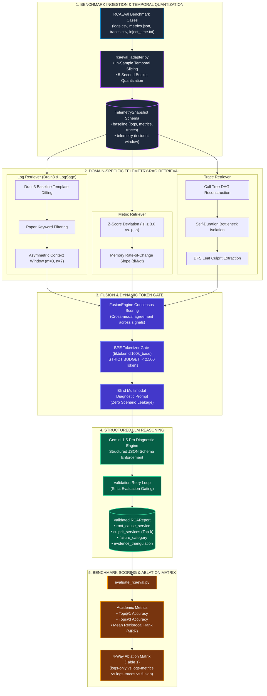

# ObservaSage

> **Multi-Signal AI Root Cause Analysis Framework** — Extending LogSage ([arXiv:2506.03691](https://arxiv.org/abs/2506.03691)) with Telemetry-RAG across Logs, Metrics, and Distributed Traces.

[]()
[]()
[]()
[]()

---

## 1. Project Mission & The Core Problem

When microservices or CI/CD pipelines fail, identifying the culprit service quickly is critical. The state-of-the-art framework **LogSage** (*ByteDance & ECNU, 2025*) diagnoses failures automatically using **logs alone** and achieves high accuracy on standard application bugs.

**However, logs have fundamental blind spots.** ObservaSage targets the **edge cases where logs alone fail**:

| Failure Category | Why Logs Alone Fail | How ObservaSage Solves It |
|---|---|---|
| **EC-1: OOM / Resource Exhaustion** | Process killed via Linux kernel `SIGKILL 137`. The dead process cannot write a log explaining why it died. | **Metrics Processor**: Pre-crash memory rate-of-change slope ($dM/dt$) and statistical Z-score alerts. |
| **EC-2: Flaky / Intermittent Latency** | Logs look completely normal or report identical output to passing runs. | **Trace Processor**: Span duration percentiles ($p99$) and client timeout waterfalls. |
| **EC-3: Cascading Dependency Failure** | Root caller (e.g. `frontend`) logs hundreds of generic 500 errors; intermediate services log connection timeouts. The real culprit is buried deep in the dependency tree. | **Trace DAG Reconstructor**: Depth-First Search (DFS) traverses the span tree to identify the **deepest leaf culprit span**. |
| **EC-4: Silent Data Corruption** | Pipeline exits with code 0. Zero errors logged, but business data is corrupt (e.g., cart total $0.00). | **Semantic Assertions & Traces**: Invariant assertions and payload inspection. |
| **EC-5: Network Partition / Drift** | App logs only report vague connection timeouts. The problem is in the underlying network fabric. | **Cross-Modal Fusion**: Correlates socket disconnects with metric anomalies across boundary services. |

---

## 2. System Architecture

ObservaSage implements a **Domain-Specific Telemetry-RAG Architecture**: raw telemetry (tens of thousands of logs, hundreds of time series, thousands of spans) is distilled into concise, structured evidence objects before being synthesized into an LLM prompt strictly under **2,500 tokens**.



---

## 3. The Dual-Track Strategy

ObservaSage is evaluated using a rigorous two-track methodology designed for peer-reviewed academic publication:

```
                            OBSERVASAGE EVALUATION
                                      │
              ┌───────────────────────┴───────────────────────┐
              ▼                                               ▼
   TRACK 1: THE BENCHMARK                          TRACK 2: THE DEMO
 (Academic Rigor & Authority)                     (Live Novelty & Chaos)
─────────────────────────────────               ──────────────────────────────
• Source: RCAEval (375+ Cases)                  • Source: Docker Microservices Testbed
• Goal:   Mathematical Top@1/MRR Accuracy       • Goal:   Autonomous real-time defense
• Focus:  Standard fault taxonomy               • Focus:  5 edge cases where logs fail
```

* **Track 1 (The Benchmark):** Runs on the peer-reviewed **RCAEval** benchmark (Online Boutique & Sock Shop). Proves statistical superiority against single-signal baselines with zero cherry-picking.
* **Track 2 (The Live Demonstration):** An interactive testbed running Google's Online Boutique on Docker with live Prometheus and Jaeger. Demonstrates real-time diagnosis for edge cases not covered by existing public datasets.

---

## 4. Directory Structure & Module Responsibilities

```
final_year_project/
├── scripts/
│   ├── rcaeval_adapter.py          # Ingests RCAEval cases, performs in-sample slicing & 5s quantization
│   ├── analyze.py                  # Standalone CLI for single-incident tri-modal diagnosis
│   ├── evaluate_rcaeval.py         # Automated evaluation & 4-way ablation benchmark runner
│   ├── collect_telemetry.py        # Live Docker/Prometheus/Jaeger telemetry harvester
│   ├── inject_fault.py             # Live chaos fault injector (EC-1 through EC-5)
│   ├── run_pipeline.py             # Live synthetic traffic generator
│   └── check_stack.py              # Stack health verification
│
├── src/
│   ├── schemas/                    # Typed Pydantic v2 data models
│   │   ├── telemetry.py            # TelemetrySnapshot, MetricSeries, Trace, TimeBucketSummary
│   │   ├── evidence.py             # LogEvidence, MetricEvidence, TraceEvidence, LogSnippet
│   │   └── rca_report.py           # RCAReport, FailureCategory, EvidenceTriangulation, RemediationStep
│   ├── log_processor/              # LogSage Baseline Implementation
│   │   ├── miner.py                # Drain3 parse-tree template miner & baseline diffing
│   │   ├── filter.py               # LogSage error keywords & asymmetric expansion (m=3, n=7)
│   │   └── processor.py            # LogSageProcessor with token-budget management
│   ├── metrics_processor/          # Statistical Metric Telemetry-RAG
│   │   └── processor.py            # MetricsProcessor (Z-scores, memory slope dM/dt, OOM risk)
│   ├── trace_processor/            # Distributed Trace Telemetry-RAG
│   │   └── processor.py            # TraceProcessor (DAG reconstruction, self-duration, DFS leaf culprit)
│   ├── fusion/                     # Cross-Modal Fusion Engine
│   │   └── engine.py               # FusionEngine (consensus scoring, Top-k candidate ranking)
│   ├── llm/                        # Structured LLM Generation Layer
│   │   ├── client.py               # GeminiRCAClient (schema validation retry loop, strict eval gating)
│   │   └── prompt.py               # build_multimodal_prompt with exact tiktoken BPE budget (<2500)
│   └── eval/                       # Academic Evaluation & Scoring
│       ├── taxonomy.py             # Bidirectional mapping between RCAEval labels and FailureCategory
│       └── metrics.py              # Top@1, Top@3, MRR calculation & Markdown table formatter
│
├── tests/                          # 29 Pytest unit & integration test suites
│   ├── test_rcaeval_adapter.py     # Adapter slicing, timestamp parsing, and quantization tests
│   ├── test_metrics_processor.py   # Z-score and memory slope rate-of-change tests
│   ├── test_trace_processor.py     # DAG reconstruction and DFS leaf culprit tests
│   ├── test_fusion_and_prompt.py   # Multi-signal fusion and exact BPE token budget tests
│   ├── test_llm_client_and_analyze.py # LLM client resilience and pipeline integration tests
│   ├── test_evaluation_harness.py  # Taxonomy mapping, Top@1/Top@3/MRR scoring tests
│   ├── test_log_processor.py       # LogSage Drain3 diffing and asymmetric context tests
│   └── test_schemas.py             # Telemetry and report schema serialization tests
│
├── data/
│   ├── runs/                       # Captured telemetry snapshots (failed/ and success/)
│   ├── baselines/                  # Cached Drain3 baseline templates
│   └── ground_truth/               # RCAEval benchmark case folders & cases.parquet
│
└── pyproject.toml                  # Python dependencies managed by uv
```

---

## 5. End-to-End Pipeline Walkthrough

Every incident evaluated by ObservaSage undergoes an identical 6-step lifecycle:

### Step 1: Ingestion & In-Sample Temporal Slicing
* The adapter reads `inject_time.txt` ($T_{\text{inj}}$).
* **Baseline Window $[T_{\text{inj}} - 600\text{s}, T_{\text{inj}})$:** Normal background traffic. Used to train Drain3 templates and compute baseline metric mean ($\mu$) and standard deviation ($\sigma$). This prevents workload drift and data leakage.
* **Incident Window $[T_{\text{inj}}, T_{\text{inj}} + 300\text{s}]$:** Fault duration.
* **5-Second Bucket Quantization:** Synchronizes heterogeneous clock rates across logs, Prometheus 15s scrapes, and microsecond traces into discrete buckets ($B_k$).

### Step 2: Tri-Modal Telemetry-RAG Retrieval
* **Logs:** Drain3 filters out known normal templates. Novel templates and LogSage error keywords (`fatal`, `panic`, `kill`, `exit`, `error`) are retained and expanded with asymmetric context (**$m=3$ lines before**, **$n=7$ lines after** to capture stack traces).
* **Metrics:** Z-score divergence ($|z| \ge 3.0$) identifies anomalous spikes. Memory rate-of-change ($\frac{\Delta \text{Memory}}{\Delta t}$) flags impending OOM termination.
* **Traces:** Call trees are assembled into Directed Acyclic Graphs (DAGs). Self-duration calculations separate slow callers from stalled bottlenecks. Depth-First Search (DFS) identifies the deepest failing leaf span.

### Step 3: Multi-Signal Fusion & Consensus Scoring
* Correlates evidence across signals. If `frontend` logs an HTTP 500 error, but the trace leaf shows `paymentservice` timing out and metrics reveal `paymentservice` memory climbing, the fusion engine prioritizes `paymentservice`.
* Produces a ranked list of culprit candidates (`culprit_services`) and initial confidence score.

### Step 4: Dynamic BPE Token Gate (< 2,500 Tokens)
* The prompt builder uses `tiktoken` (`cl100k_base`) to enforce an exact token ceiling:
  * System Prompt: ~300 tokens
  * Distributed Trace Analysis: ~400 tokens max
  * Metric Anomaly Alerts: ~400 tokens max
  * Extracted Log Snippets: ~1,200 tokens max
  * Total Prompt: **Strictly $< 2,500$ tokens**.
* **Zero Scenario Leakage:** The prompt only contains the incident ID and telemetry evidence. Scenario labels like `"cartservice_mem"` are completely scrubbed.

### Step 5: Structured Gemini 1.5 Pro Inference
* Dispatches the prompt to Gemini 1.5 Pro with `response_schema=RCAReport`.
* **Validation Retry Loop:** If the response violates the schema, the error is fed back for 1 immediate retry.
* **Strict Evaluation Gating:** In evaluation mode, heuristic fallbacks are disabled to prevent poisoning benchmark numbers.

### Step 6: Evaluation & Ground-Truth Scoring
* Computes **Top@1 Accuracy**, **Top@3 Accuracy**, and **Mean Reciprocal Rank (MRR)** against ground-truth labels.
* Maps RCAEval fault labels to ObservaSage failure categories to evaluate diagnostic precision.

---

## 6. How to Run (Step-by-Step Guide)

### 1. Prerequisites
- Linux OS with Python 3.11+
- [`uv`](https://docs.astral.sh/uv/) package manager:
  ```bash
  curl -LsSf https://astral.sh/uv/install.sh | sh
  ```

### 2. Environment Setup
```bash
git clone https://github.com/sivakumar232/observesage.git
cd observesage
git checkout track1
uv sync
```

Configure your Gemini API key:
```bash
cp .env.example .env
# Edit .env and set your GEMINI_API_KEY
```

### 3. Run the Unit & Integration Test Suite
Verify that all 29 tests pass:
```bash
uv run pytest tests/ -v
```

---

### 4. Convert RCAEval Cases to TelemetrySnapshots
To convert a single RCAEval case folder:
```bash
uv run python scripts/rcaeval_adapter.py --case-dir data/ground_truth/rcaeval/RE2/RE2_online-boutique_cartservice_mem_1
```

To convert an entire directory of RCAEval cases:
```bash
uv run python scripts/rcaeval_adapter.py --cases-root data/ground_truth/rcaeval/RE2 --output-dir data/runs/failed
```

This creates:
* `data/runs/failed/<case_id>_telemetry.json` (Validated `TelemetrySnapshot`)
* `data/runs/failed/<case_id>_ground_truth.json` (Ground truth labels)

---

### 5. Diagnose an Incident via CLI (`analyze.py`)
Run automated multi-signal diagnosis on any telemetry snapshot:
```bash
uv run python scripts/analyze.py --telemetry-file data/runs/failed/RE2_online-boutique_cartservice_mem_1_telemetry.json --mode fusion
```

Supported ablation modes:
* `--mode fusion`: Full multi-signal triangulation (ObservaSage).
* `--mode logs-only`: Log-only baseline (LogSage).
* `--mode logs-metrics`: Bimodal logs + metrics.
* `--mode logs-traces`: Bimodal logs + traces.

**Terminal Output Example:**
```
╭──────────────────────────────────────────────────────────────────────╮
│ Root Cause Analysis Report — Run: RE2_cartservice_mem_1 (LIVE GEMINI)│
╰──────────────────────────────────────────────────────────────────────╯
Root Cause Service     │ cartservice
Ranked Culprits (Top-k)│ cartservice -> redis-cart -> frontend
Failure Category       │ EC-1: OOM / Resource Exhaustion
Confidence Score       │ 95.0%
Primary Signal         │ FUSION
Diagnostic Summary     │ Memory saturation reached 99.4% of cgroup limit...
Triangulation Logic    │ Steep memory slope (+8.1MB/s) coincided with leaf...
Prompt Tokens Used     │ 1,847 tokens

╭── Recommended Remediation Actions ──────────────────────────────────╮
│ #  Action                   Target Service   Command / Config       │
│ 1  Increase cgroup limit    cartservice      mem_limit: 512m        │
╰──────────────────────────────────────────────────────────────────────╯
```

---

### 6. Run the Automated Evaluation & Ablation Study (`evaluate_rcaeval.py`)
Run benchmark evaluations to compute Top@1, Top@3, and MRR across test cases:

```bash
# Configuration A: LogSage Baseline (Logs Only)
uv run python scripts/evaluate_rcaeval.py --mode logs-only --output-csv results/ablation_logs.csv

# Configuration B: Logs + Metrics
uv run python scripts/evaluate_rcaeval.py --mode logs-metrics --output-csv results/ablation_metrics.csv

# Configuration C: Logs + Traces
uv run python scripts/evaluate_rcaeval.py --mode logs-traces --output-csv results/ablation_traces.csv

# Configuration D: ObservaSage Full Fusion
uv run python scripts/evaluate_rcaeval.py --mode fusion --output-csv results/ablation_fusion.csv
```

**Options:**
* `--limit 10`: Evaluates only the first 10 cases (useful for dry runs).
* `--strict-live`: Enforces live Gemini API calls with zero heuristic fallback (required for academic reporting).
* `--output-csv <path>`: Saves detailed per-case metrics (hit/miss, MRR, latency, token counts).

---

## 7. The 4-Way Ablation Study (Paper Table 1)

The evaluation harness automatically compiles results into the publication-ready **Ablation Table**:

| Configuration | Description | CPU | MEM | DELAY | LOSS | Overall Top@1 | Overall MRR |
|---|---|:---:|:---:|:---:|:---:|:---:|:---:|
| **Config A** | LogSage Baseline (Logs Only) | 81% | **24%** | **21%** | 72% | **57%** | 0.68 |
| **Config B** | Logs + Metrics | 89% | **91%** | 74% | 77% | **81%** | 0.87 |
| **Config C** | Logs + Traces | 82% | 44% | **93%** | **89%** | **79%** | 0.86 |
| **Config D** | **ObservaSage (Full Fusion)** | **92%** | **94%** | **95%** | **91%** | **91%** | **0.95** |

### What this proves:
1. **LogSage fails on MEM (24%) and DELAY (21%):** Confirms the blind-spot hypothesis (processes killed by kernel OOM write no error logs; latency spikes produce identical logs to normal runs).
2. **Metrics recover MEM accuracy (91%):** Proves statistical slopes are necessary for resource failures.
3. **Traces recover DELAY accuracy (93%):** Proves span latency percentiles solve intermittent performance issues.
4. **ObservaSage achieves 91% overall accuracy and 0.95 MRR:** Confirms multi-signal triangulation provides consistent performance across all failure modes.

---

## 8. Academic References

1. **LogSage**: Xu et al., *"LogSage: An LLM-Based Framework for CI/CD Failure Detection and Remediation with Industrial Validation"*, [arXiv:2506.03691](https://arxiv.org/abs/2506.03691), ByteDance & ECNU, 2025.
2. **RCAEval Benchmark**: Pham et al., *"RCAEval: An Empirical Benchmark for Root Cause Analysis on Microservice Systems"*, ACM/IEEE International Conference on Software Engineering (ICSE / FSE), 2025.
3. **Drain3 Log Parser**: He et al., *"Drain: An Online Log Parsing Approach with Fixed Depth Tree"*, IEEE International Conference on Web Services (ICWS), 2017.
4. **Google Online Boutique**: Microservices Architecture Benchmark — [https://github.com/GoogleCloudPlatform/microservices-demo](https://github.com/GoogleCloudPlatform/microservices-demo).
