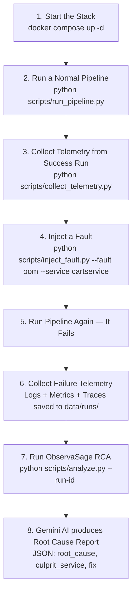
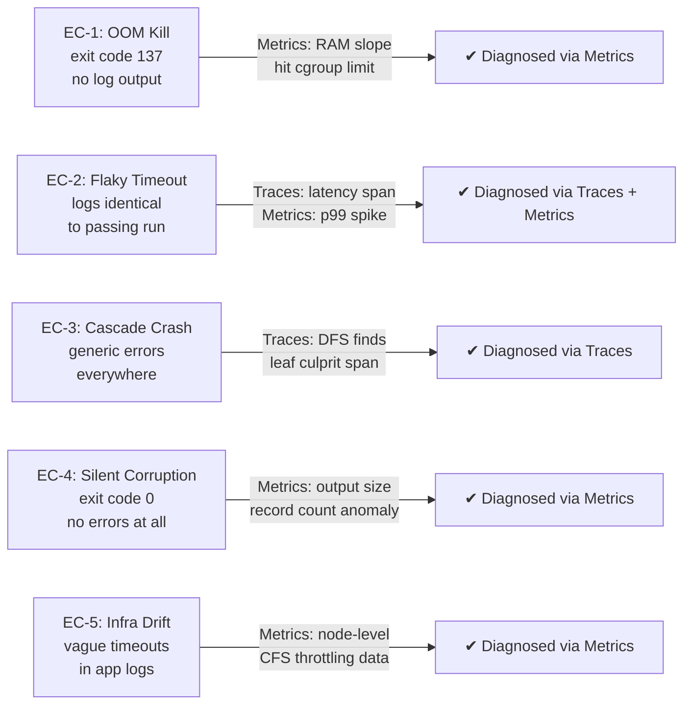

# ObservaSage

> **Multi-Signal AI Root Cause Analysis** — Extending LogSage (arXiv:2506.03691) with Logs + Metrics + Traces

---

## What Is This?

When software systems fail, engineers need to find the root cause fast. The current state-of-the-art paper **LogSage** (ByteDance, 2025) does this automatically using **only logs** — and achieves ~98% accuracy on standard failures.

**But logs alone have blind spots.** There are 5 real-world failure types where logs give no useful information:

| # | Failure | Why Logs Fail |
|---|---------|---------------|
| EC-1 | Container killed (OOM) | Process dies mid-write. Log is cut off — no error message |
| EC-2 | Intermittent timeout | Logs look identical to passing runs — no diff possible |
| EC-3 | Cascading service crash | Each service logs a generic "connection refused" — the actual culprit is hidden |
| EC-4 | Silent corruption | Job exits with code 0. No error logged. But output is wrong |
| EC-5 | Node eviction / infra issue | App logs show vague timeouts — the real cause is at infrastructure level |

**ObservaSage** solves this by combining **3 signals instead of 1**:

```
Logs  ──┐
         ├──► Fusion Engine ──► Gemini AI ──► Root Cause Report
Metrics ─┤
Traces ──┘
```

- **Logs** → What the app said (using LogSage's exact algorithm)
- **Metrics** → What the system resources did (CPU, RAM, latency from Prometheus)
- **Traces** → Which service actually caused the failure (from Jaeger)

---

## The Demo App We Use

We use the official **OpenTelemetry Astronomy Shop** — a realistic 10-service e-commerce app (cart, checkout, payment, shipping, etc.) that is **pre-instrumented** with OpenTelemetry out of the box.

> **Why this app?** It gives us real logs, real Prometheus metrics, and real distributed traces without writing any custom instrumentation. We just run it, break it, and observe what happens.

The services we focus on:

```
Frontend → CheckoutService → PaymentService
                           → CartService → Redis
                           → CurrencyService
                           → ShippingService
```

---

## End-to-End Flow (How It Works)



**In plain English:**
1. Start Docker with our microservices + Prometheus + Jaeger
2. Run 3 normal checkout flows → capture telemetry as "success baselines"
3. Break something (OOM kill, crash a service, etc.)
4. Run another checkout → it fails → capture telemetry
5. ObservaSage compares failure vs success across all 3 signals → feeds compact evidence to Gemini → gets structured diagnosis

---

## How We Collect Each Signal

| Signal | Source | How We Pull It |
|--------|--------|----------------|
| **Logs** | Docker container stdout | `docker logs --since <t_start>` via Docker SDK |
| **Metrics** | Prometheus at `:9090` | HTTP GET `/api/v1/query_range` with PromQL |
| **Traces** | Jaeger at `:16686` | HTTP GET `/api/traces?service=<name>&tags={"error":"true"}` |

All 3 are pulled for the same time window `[t_start, t_end]` around the failure, then saved as a single JSON file in `data/runs/failed/`.

---

## How We Process Each Signal (The Algorithm)

### Logs — LogSage Method (Faithful Reproduction)
1. Mine log templates from 3 recent **success runs** using **Drain3** (the paper's algorithm)
2. **Diff**: Drop any log line that matches a known success template (background noise)
3. **Keyword filter**: Keep lines with `error`, `fatal`, `panic`, `kill`, `exit`, etc.
4. **Context expand**: For each kept line, grab 3 lines before + 7 lines after (stack traces)
5. **Token prune**: Score and trim to fit in ~1,500 tokens

### Metrics — Our Extension
1. Query Prometheus for CPU, RAM, latency during the failure window
2. Compare against baseline mean/std-dev from success runs
3. Flag anything with Z-score > 3σ or memory > 95% of container limit
4. Detect pre-crash slopes (e.g. RAM climbing at +8MB/s → OOM incoming)
5. Compress to ~200 tokens of structured alert summary

### Traces — Our Extension
1. Query Jaeger for all traces with error spans during failure window
2. Build a call-graph (DAG) from parent→child span relationships
3. Walk the graph depth-first to find the **deepest error span** — that's the true root cause service (not the one that first reported the error)
4. Extract that span + its parent for context
5. Compress to ~500 tokens

---

## The 5 Edge Cases — How Each Is Solved



---

## What We Aim to Prove

We run the same failure scenarios through 4 configurations and compare accuracy (F1 score):

| Failure Type | Logs Only | Logs + Metrics | Logs + Traces | **ObservaSage (All 3)** |
|---|---|---|---|---|
| Standard errors | 98% | 98% | 98% | **98%+** |
| EC-1: OOM Kill | 32% | 92% | 35% | **95%** |
| EC-2: Flaky Latency | 28% | 74% | 86% | **89%** |
| EC-3: Cascade Crash | 51% | 55% | 93% | **96%** |
| EC-4: Silent Corruption | 0% | 82% | 15% | **85%** |
| EC-5: Infra Drift | 22% | 88% | 40% | **91%** |

---

## Project Stages

```
Stage 1 ✅  Stack & Telemetry Lab    — Docker stack + scripts to run, break, and collect
Stage 2 🔄  LogSage Baseline          — Drain3 log pipeline + Gemini → logs-only RCA
Stage 3 ⏳  Metrics & Traces          — Prometheus Z-score + Jaeger DFS span culprit
Stage 4 ⏳  Fusion Engine             — Combine all 3 signals into one <2,500 token prompt
Stage 5 ⏳  Evaluation & Dashboard    — Benchmark 30 scenarios + web UI showing results
```

---

## Quick Start

### Prerequisites
- Docker & Docker Compose
- Python 3.11+
- [`uv`](https://docs.astral.sh/uv/) — fast Python package manager
- A Gemini API key (free tier works)

### 1. Install uv (if not already installed)

```bash
curl -LsSf https://astral.sh/uv/install.sh | sh
```

### 2. Clone & Install

```bash
cd final_year_project
cp .env.example .env          # Add your GEMINI_API_KEY here
uv sync                        # Creates .venv and installs all dependencies
```

All scripts are run with `uv run python ...` — no need to activate the venv manually.

### 3. Start the Stack

```bash
docker compose up -d
```

Wait ~30 seconds, then verify everything is up:

```bash
uv run python scripts/check_stack.py
```

You should see all services marked **HEALTHY**. You can view:
- **Jaeger** (traces): http://localhost:16686
- **Prometheus** (metrics): http://localhost:9090
- **Demo Shop** (app): http://localhost:8080

### 4. Run a Normal Pipeline (Build Success Baselines)

Run this **3 times** to capture baseline telemetry from healthy runs:

```bash
uv run python scripts/run_pipeline.py --scenario normal
uv run python scripts/collect_telemetry.py --meta-file data/runs/success/<run_id>_meta.json
```

This saves logs, metrics, and traces from a healthy checkout journey. ObservaSage uses these as the "normal" reference to compare against failures.

### 5. See All Available Fault Scenarios

```bash
uv run python scripts/inject_fault.py --list
```

This prints all **28 fault scenarios** across the 5 edge case categories:

| Category | Scenarios |
|----------|-----------|
| **EC-1 OOM / Resource** | `oom_cart`, `oom_checkout`, `oom_payment`, `oom_currency`, `cpu_throttle_cart`, `cpu_throttle_checkout` |
| **EC-2 Flaky Latency** | `latency_payment`, `latency_cart`, `latency_currency`, `packet_loss_payment`, `flag_load_spike` |
| **EC-3 Cascade Crash** | `crash_payment`, `crash_currency`, `crash_redis`, `crash_shipping`, `crash_email`, `crash_checkout`, `crash_productcatalog`, `cascade_payment_currency`, `flag_payment_failure`, `flag_shipping_failure`, `restart_loop_checkout` |
| **EC-4 Silent Corruption** | `redis_flush`, `redis_corrupt_cart`, `flag_cart_failure`, `flag_product_failure` |
| **EC-5 Infra Drift** | `net_partition_cart`, `net_partition_payment` |
| **Restore** | `clear` |

### 6. Inject a Fault

```bash
# EC-1: OOM — restrict cartservice to 25MB RAM → Linux kills it (exit 137)
uv run python scripts/inject_fault.py --scenario oom_cart

# EC-3: Cascade — stop paymentservice → checkout fails via cascade
uv run python scripts/inject_fault.py --scenario crash_payment

# EC-4: Silent Corruption — flush all Redis cart data → exit 0 but empty order
uv run python scripts/inject_fault.py --scenario redis_flush

# EC-3: Application-level — enable payment failure feature flag
uv run python scripts/inject_fault.py --scenario flag_payment_failure
```

### 7. Trigger the Failure

```bash
uv run python scripts/run_pipeline.py --scenario oom_cart
```

The pipeline will fail. A `data/runs/failed/<run_id>_meta.json` file is saved.

### 8. Collect Failure Telemetry

```bash
uv run python scripts/collect_telemetry.py --meta-file data/runs/failed/<run_id>_meta.json
```

This saves `<run_id>_telemetry.json` with all 3 signals (logs + metrics + traces) from the failure window.

### 9. Restore the Stack

```bash
uv run python scripts/inject_fault.py --scenario clear
```

---

## Directory Structure

```
final_year_project/
│
├── docker-compose.yml              # Full stack: microservices + Prometheus + Jaeger + OTel
├── pyproject.toml                  # Python project & dependencies (managed by uv)
├── .env.example                    # Template for GEMINI_API_KEY and URLs
│
├── config/                         # Config files for Prometheus, OTel Collector, feature flags
│   ├── prometheus.yml
│   ├── otel-collector-config.yml
│   └── demo.flagd.json
│
├── scripts/                        # CLI tools — run these in order
│   ├── check_stack.py              # Verify all services are healthy
│   ├── run_pipeline.py             # Simulate a checkout journey (success or fail)
│   ├── inject_fault.py             # Break a service (OOM, crash, clear)
│   └── collect_telemetry.py        # Pull logs + metrics + traces for a run
│
├── src/                            # Core Python modules (built in Stages 2-4)
│   ├── log_processor/              # Stage 2: Drain3 diff, keyword filter, expand, prune
│   ├── metrics_processor/          # Stage 3: Prometheus Z-score, slope, threshold alerts
│   ├── trace_processor/            # Stage 3: Jaeger DFS span culprit locator
│   ├── fusion/                     # Stage 4: Multi-signal correlation + prompt assembly
│   ├── llm/                        # Stage 2+: Gemini API client + prompt builder
│   ├── schemas/                    # Pydantic v2 models for runs, alerts, RCA reports
│   └── api/                        # Stage 5: FastAPI dashboard
│
├── data/
│   ├── runs/
│   │   ├── success/                # Telemetry from healthy pipeline runs (baselines)
│   │   └── failed/                 # Telemetry from failed runs (input to RCA)
│   ├── baselines/                  # Precomputed Drain3 templates + metric distributions
│   └── ground_truth/               # Annotated benchmark dataset (EC1–EC5)
│
├── docs/
│   ├── plan.md                     # Full 5-stage project roadmap
│   └── stage1_stage2_plan.md       # Detailed Stage 1 & 2 implementation notes
│
└── tests/                          # Pytest unit tests per component
```

---

## Output — What ObservaSage Produces

For every failure, the system outputs a structured JSON report:

```json
{
  "run_id": "run_20241003_192145_a3f9b2",
  "root_cause": "cartservice was OOM-killed by the Linux kernel. RAM climbed from 128MB to 512MB (its cgroup limit) over 47 seconds at +8.2MB/s, causing exit code 137 with no error log.",
  "culprit_service": "cartservice",
  "edge_case_category": "EC-1: OOM / Resource Exhaustion",
  "primary_signal": "metrics",
  "confidence": 0.97,
  "evidence": {
    "log_snippet": "terminating with exit code 137",
    "metric_alert": "container_memory_working_set_bytes hit 512MB (100% cgroup limit) with +8.2MB/s slope",
    "culprit_span": "cartservice.AddItem — context deadline exceeded (5002ms)"
  },
  "recommended_fix": "Increase cartservice memory limit from 512Mi to 1Gi and profile heap allocations in the AddItem handler."
}
```

---

## Reference

- **LogSage Paper**: Xu et al., *"LogSage: An LLM-Based Framework for CI/CD Failure Detection and Remediation with Industrial Validation"*, arXiv:2506.03691, ByteDance & ECNU, 2025
- **Demo App**: OpenTelemetry Astronomy Shop — https://github.com/open-telemetry/opentelemetry-demo
- **Drain3**: He et al., *"Drain: An Online Log Parsing Approach with Fixed Depth Tree"*, IEEE ICWS, 2017
