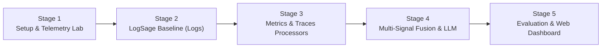

# ObservaSage: End-to-End Master Project Plan
### From Concept to Working System & Evaluation (A Complete Roadmap)

---

## 1. What Are We Building & Why?

**The Context**:
In 2025, ByteDance published **LogSage** (*arXiv:2506.03691*), an AI system that diagnoses CI/CD pipeline failures by analyzing raw log text with an LLM. While it achieves 98% accuracy on standard log errors, **logs alone have blind spots**:
- When a container runs Out Of Memory (OOM), Linux kills it instantly; the log is cut short with zero error stack trace.
- When an upstream service crashes, downstream services log generic "connection refused" messages, obscuring the true root cause.
- When network latency spikes intermittently, logs look identical to passing runs.

**Our Project (ObservaSage)**:
We extend LogSage into a **multi-signal diagnostic framework** that fuses **Logs + Prometheus Metrics + Jaeger Distributed Traces**. We evaluate both standard failures and 5 critical edge cases to prove that multi-signal observability solves these blind spots.

---

## 2. The 5 Project Stages (Overview)



| Stage | Name | Key Deliverable |
|---|---|---|
| **Stage 1** | **Telemetry Test Lab & CI Simulator** | Running Docker microservices + Prometheus + Jaeger + automated test runner & fault injector. |
| **Stage 2** | **LogSage Baseline Replication** | Drain3 log template miner + keyword filter + context expander + token pruner + Gemini LLM. |
| **Stage 3** | **Metrics & Traces Processors** | Prometheus Z-score & slope detector + Jaeger DFS span tree culprit locator. |
| **Stage 4** | **Multi-Signal Fusion Engine** | Correlator combining logs, metrics, and traces into an optimized prompt (<2,500 tokens). |
| **Stage 5** | **Evaluation & Web Dashboard** | Benchmark on 30 failure scenarios (Ablation study) + interactive FastAPI dashboard. |

---

## 3. Detailed Stage-by-Stage Plan

### Stage 1: The Telemetry Test Lab & CI Simulator
**Goal**: Have a working local environment that produces real logs, metrics, and traces, plus a test runner that executes pipeline runs and records pass/fail telemetry.
1. **Docker Compose Stack**: Core microservices (`frontend`, `cartservice`, `checkoutservice`, `paymentservice`, `currencyservice`, `redis-cart`) + `otel-collector` + `prometheus` + `jaeger`.
2. **Stack Healthcheck (`scripts/check_stack.py`)**: Script ensuring all HTTP/gRPC ports are responsive.
3. **CI/CD Pipeline Simulator (`scripts/run_pipeline.py`)**: Executes an automated checkout test (Cart $\rightarrow$ Checkout $\rightarrow$ Payment), measures run window $[t_{\text{start}}, t_{\text{end}}]$, and records metadata.
4. **Fault Injector (`scripts/inject_fault.py`)**: Programmatically triggers failures (OOM memory limits, network latency delays, service kills).

---

### Stage 2: LogSage Baseline Replication (Logs-Only Pipeline)
**Goal**: Implement the exact log preprocessing pipeline from Section III-B of the ByteDance paper as our comparison baseline.
1. **Offline Template Mining (`src/log_processor/drain_extractor.py`)**: Run 3 successful pipeline runs; parse their logs using the **Drain3 algorithm** to extract recurring background templates into `data/baselines/success_templates.json`.
2. **Key Log Filtering (`src/log_processor/key_log_filter.py`)**:
   - *Log Diff*: Drop any log line matching recurring success templates.
   - *Keyword Match*: Retain lines containing `fatal`, `error`, `panic`, `kill`, `exit code`, etc.
   - *Tail Priority*: Prioritize the last lines before job failure.
3. **Context Expansion (`src/log_processor/key_log_expander.py`)**: Asymmetric window ($m=3$ lines before, $n=7$ lines after) to preserve stack traces.
4. **Token Pruning (`src/log_processor/token_pruner.py`)**: Score and trim blocks to stay within the ~2,000 token limit.
5. **RCA Prompts (`src/llm/gemini_client.py`)**: Pass critical log blocks to Gemini for a structured JSON RCA report.

---

### Stage 3: Adding the Two New Signals (Metrics & Traces)
**Goal**: Extract high-density signals from Prometheus and Jaeger to cover what logs miss.
1. **Metrics Processor (`src/metrics_processor/`)**:
   - Query Prometheus for $[t_{\text{start}}, t_{\text{end}}]$.
   - Compute **Z-scores** ($|Z| > 3.0$) and **cgroup threshold alerts** (e.g. memory $> 95\%$ of limit).
   - Detect **slopes / gradients** ($\Delta M / \Delta t$) to catch memory leaks leading to OOM kills.
2. **Trace Processor (`src/trace_processor/`)**:
   - Query Jaeger for traces with error spans during the failure window.
   - Construct the span call graph (DAG).
   - Run **Deepest Leaf Culprit Search (DFS)**: Find the deepest descendant span with `status = ERROR` to isolate the true root cause in cascading failures.

---

### Stage 4: Multi-Signal Fusion Engine & LLM Reasoning
**Goal**: Fused intelligence — cross-correlating all three signals into an unambiguous diagnostic prompt.
1. **Signal Correlation (`src/fusion/signal_fuser.py`)**:
   - Correlate timestamps between log drop-offs, metric spikes, and span timeouts.
   - Attach edge-case classifications (`EC-1: OOM`, `EC-2: Flaky Latency`, `EC-3: Cascade`, `EC-4: Corruption`, `EC-5: Infra`).
2. **Dynamic Prompt Assembly (`src/fusion/prompt_assembler.py`)**:
   - Combine pruned log blocks (~1,200 tokens), metric alerts (~200 tokens), and culprit span subtrees (~500 tokens) into a prompt strictly under **2,500 tokens**.
3. **Structured Pydantic Validation (`src/schemas/rca_report.py`)**:
   - Output structured JSON containing `root_cause`, `culprit_service`, `primary_signal`, `confidence`, and `recommended_fix`.

---

### Stage 5: Evaluation & Web Dashboard
**Goal**: Produce the empirical evidence for your final year project presentation and viva.
1. **Benchmark Suite**: Run 30 test scenarios across 4 configurations:
   - Config A: Logs only (LogSage paper reproduction)
   - Config B: Logs + Metrics
   - Config C: Logs + Traces
   - Config D: ObservaSage (All 3 signals)
2. **Ablation Results**: Calculate Precision, Recall, and F1-score across standard errors and all 5 edge cases.
3. **Interactive Dashboard (`src/api/`)**: Single-page FastAPI dashboard displaying:
   - Pipeline failure feed.
   - Signal attribution badge (*"Diagnosed via: Metrics & Traces"*).
   - Visual comparison showing how the log-only system failed while ObservaSage succeeded.

---

## 4. Execution Roadmap Summary

```
[NOW] Stage 1 ──► Docker Compose + Prometheus + Jaeger + CI Runner + Fault Injector
  │
[NEXT] Stage 2 ──► Drain3 Log Diff + Pruning + Gemini Baseline RCA
  │
[THEN] Stage 3 ──► Prometheus Z-score/Slope + Jaeger DFS Span Culprit
  │
[THEN] Stage 4 ──► Multi-Signal Fusion + Dynamic Prompt Assembly (<2,500 tokens)
  │
[DONE] Stage 5 ──► 30-case Benchmark (Ablation Matrix) + Interactive Dashboard
```

flowchart TD
    subgraph INGESTION["Stage 1: Benchmark Dataset Ingestion (rcaeval_adapter.py)"]
        D1[("logs.parquet\n(171k raw lines)")]
        D2[("metrics.parquet\n(72 PromQL series)")]
        D3[("traces.parquet\n(391k Jaeger spans)")]
        D4["inject_time.txt & cases.parquet"]
        
        D1 & D2 & D3 & D4 --> ADAPT["RCAEval Adapter\nTemporal Slicing"]
        ADAPT -->|Window: T_inj - 600s to T_inj| BASE["Normal Baseline Telemetry"]
        ADAPT -->|Window: T_inj to T_inj + 300s| INC["Active Incident Telemetry"]
        BASE & INC --> SNAPSHOT[("TelemetrySnapshot\n(Standardized JSON)")]
    end

    subgraph RAG_RETRIEVER["Stage 2: Multi-Modal Telemetry-RAG Retriever (src/rag/retriever.py)"]
        SNAPSHOT --> RETRIEVER["TelemetryRAGRetriever\nMulti-Modal Anomaly Extraction"]

        subgraph RET_LOGS["1. Log Retriever (LogSage + Probe Filter)"]
            RETRIEVER --> DRAIN["Drain3 Template Mining\nDiff incident vs. baseline templates"]
            DRAIN --> KW["Keyword Filter\n('fail', 'error', 'kill', 'exception')"]
            KW --> EXPAND["Asymmetric Context Window\nm=3 before, n=7 after (Probe-filtered)"]
            EXPAND --> LOG_EV["LogEvidence\nNovel templates & clean snippets"]
        end

        subgraph RET_METRICS["2. Metric Retriever (Robust + Limit-Aware)"]
            RETRIEVER --> VECT["Non-Parametric & Gaussian Stats\nMean μ, Std σ, Median, MAD"]
            VECT --> ZSCORE["Robust Z-Score (MAD)\nNon-parametric anomaly detection"]
            ZSCORE --> SLOPE["Memory Slope & TimeToOOM\ncgroup quota correlation"]
            SLOPE --> METRIC_EV["MetricEvidence\nRanked metric anomaly alerts"]
        end

        subgraph RET_TRACES["3. Trace Retriever (Topology-Aware)"]
            RETRIEVER --> DAG["Span DAG Reconstruction\nService Dependency Topology"]
            DAG --> SELF["Self-Duration & Timeout Inversion\n504 / Deadline bottleneck detection"]
            SELF --> DFS["DFS Traversal\nDeepest bottleneck leaf culprit"]
            DFS --> TRACE_EV["TraceEvidence\nRoot-cause leaf service & Call Graph"]
        end

        LOG_EV & METRIC_EV & TRACE_EV --> FUSION["Topological Causal Engine & Consensus Multiplier"]
        FUSION --> RANK["Topologically Ranked Candidates\nCaller damping & callee attribution"]
        RANK --> SYNTH["Proportional Dynamic RAG Prompt Assembler\nBalanced Token Budget & Topology"]
        SYNTH --> RAG_CTX[("RetrievedRAGContext\nGrounded Anomaly Evidence")]
    end

    subgraph GENERATION["Stage 3: Generative LLM Reasoning (src/llm/client.py)"]
        RAG_CTX --> GEMINI["Gemini 1.5 Pro / Flash Client\nStructured Pydantic v2 Schema"]
        GEMINI --> PROMPT_IN["System Prompt + Retrieved RAG Prompt"]
        PROMPT_IN --> LLM_GEN["Gemini Inference\nTemperature: 0.1"]
        LLM_GEN --> SCHEMA_VAL{"Pydantic v2\nSchema Validation"}
        SCHEMA_VAL -->|Success| REPORT[("Validated RCAReport\n• Root Cause Service\n• Top-k Culprits\n• Failure Category\n• Remediation Steps")]
        SCHEMA_VAL -->|Invalid| RETRY["Retry Loop with\nValidation Diagnostics"]
        RETRY --> LLM_GEN
    end

    subgraph EVALUATION["Stage 4: Academic Benchmark Evaluation (scripts/evaluate_rcaeval.py)"]
        REPORT --> EVAL_ENG["Academic Metric Scoring Engine\n(Transparent Live vs. Offline Reporting)"]
        SNAPSHOT -->|Ground Truth: Metadata| EVAL_ENG
        EVAL_ENG --> RES["Academic Evaluation Metrics:\n✔ Top@1 Accuracy\n✔ Top@3 Accuracy\n✔ MRR\n✔ Fault Classification Accuracy\n✔ Engine Transparency (Live LLM vs. Retriever)"]
    end


