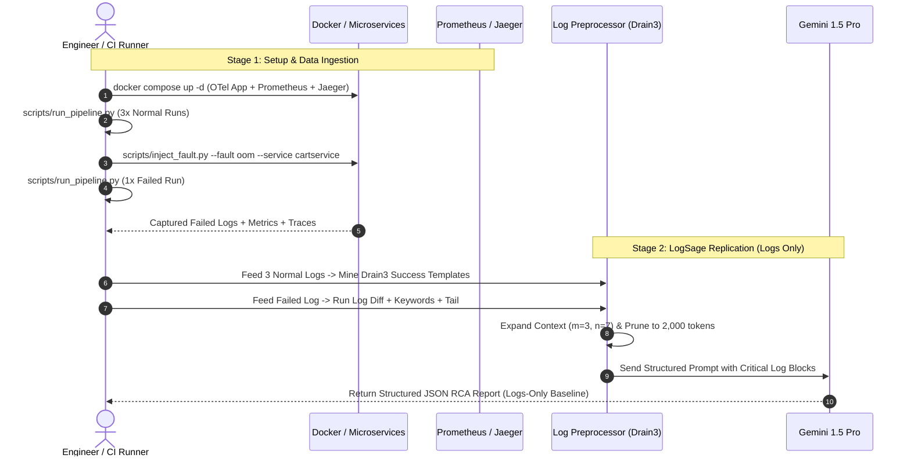

# Detailed Implementation Plan: Stage 1 & Stage 2

This document provides the concrete execution details for **Stage 1 (Environment, Observability Stack & Local CI/CD Runner)** and **Stage 2 (LogSage Baseline Replication)**.

---

## Stage 1: Environment, Observability Stack & Local CI/CD Runner

### 1. Goal
1. Stand up a realistic, instrumented microservice application with logs, metrics, and traces flowing into storage backends.
2. Build a local CI/CD test runner that simulates pipeline runs, captures execution windows ($t_{\text{start}}$ to $t_{\text{end}}$), and tags runs as `SUCCESS` or `FAILED`.
3. Provide automated fault injection to produce realistic failures for dataset generation.

---

### 2. Component Breakdown & Files to Create

```
final_year_project/
├── .env.example                         # Environment variables (Gemini API key, ports, paths)
├── docker-compose.yml                   # OTel Demo Microservices + Prometheus + Jaeger + Collector
├── pyproject.toml                       # Python dependencies & tooling
├── config/
│   ├── prometheus.yml                   # Prometheus scrape configuration
│   └── otel-collector-config.yml        # OpenTelemetry Collector pipelines (OTLP -> Jaeger, Prometheus)
├── scripts/
│   ├── check_stack.py                   # Healthcheck validator for Docker, Prometheus, Jaeger
│   ├── run_pipeline.py                  # Local CI/CD pipeline simulation runner
│   └── inject_fault.py                  # Fault injection manager (OOM, Latency, Cascade, Crash)
└── data/
    ├── runs/                            # Raw telemetry runs captured by CI runner
    │   ├── success/
    │   └── failed/
    └── ground_truth/                    # Metadata and expected RCA labels
```

---

### 3. Technical Specifications & Implementation Steps

#### Step 1.1: Dependency & Environment Setup
- **File**: `pyproject.toml`
- **Key Libraries**:
  - `docker` (Python SDK for Docker to inspect containers, memory cgroups, and logs)
  - `requests` (Prometheus & Jaeger HTTP queries)
  - `drain3` (Log template extraction via Drain algorithm)
  - `google-genai` / `google-generativeai` (Gemini 1.5 Pro / Flash)
  - `pydantic` (Data schemas for logs, metrics, traces, and RCA reports)
  - `pytest` & `httpx` (Integration test execution for simulated CI/CD)
  - `rich` (CLI terminal output and progress reporting)

#### Step 1.2: Lightweight Observability Stack (`docker-compose.yml`)
The full OpenTelemetry Astronomy demo contains 14+ services. Running all 14 simultaneously can be memory-heavy on a laptop (~6-8 GB RAM).
- We select the **core checkout journey subset** (or full demo if system resources permit):
  1. `frontend` (User interface / entrypoint HTTP server)
  2. `checkoutservice` (Orchestrates checkout, coordinates calls)
  3. `cartservice` (Stateful cart stored in Redis)
  4. `paymentservice` (gRPC payment processor)
  5. `currencyservice` (Currency conversions)
  6. `redis-cart` (Backing store for cart)
  7. `otel-collector` (Receives OTLP telemetry on `4317`/`4318`)
  8. `jaeger` (Traces UI on `16686`, OTLP receiver on `4317`)
  9. `prometheus` (Scrapes metrics on `9090`)

#### Step 1.3: Healthcheck Script (`scripts/check_stack.py`)
- Automatically probes:
  - Docker daemon connectivity.
  - Prometheus readiness: `GET http://localhost:9090/-/ready` $\rightarrow$ 200 OK.
  - Jaeger readiness: `GET http://localhost:16686/` $\rightarrow$ 200 OK.
  - OTel Collector gRPC port `4317` connectivity.
  - Core microservice HTTP endpoints.

#### Step 1.4: CI/CD Pipeline Simulator (`scripts/run_pipeline.py`)
In real software development, CI/CD runs end-to-end integration tests on every commit:
```
Commit / PR --> CI Pipeline Started (t_start) --> Run Integration Tests --> Result (Pass/Fail) (t_end)
```
- **How `run_pipeline.py` works**:
  1. Generates a unique `run_id` (e.g., `run_20261003_184512_succ`).
  2. Records timestamp $t_{\text{start}} = \text{now()}$.
  3. Executes an automated transaction suite:
     - `GET /` (Homepage load)
     - `POST /api/cart` (Add items to cart)
     - `POST /api/checkout` (Submit order with credit card details)
  4. If all HTTP/gRPC calls succeed within SLA $\rightarrow$ Status: `SUCCESS`.
  5. If any call errors or times out $\rightarrow$ Status: `FAILED`, exit code 1.
  6. Records timestamp $t_{\text{end}} = \text{now()}$.
  7. Writes metadata JSON to `data/runs/run_<id>_meta.json`.

#### Step 1.5: Fault Injection Controller (`scripts/inject_fault.py`)
Programmatically introduces deterministic faults:
- **`--fault oom --service cartservice`**: Updates container memory limit to 50MB and floods cart with items until container receives `SIGKILL` (exit code 137).
- **`--fault latency --service paymentservice --delay 4000ms`**: Injects network delay exceeding client timeout.
- **`--fault crash --service paymentservice`**: Pauses/kills `paymentservice` to trigger cascade in `checkoutservice`.
- **`--fault clear`**: Restores containers to healthy baseline state.

---

## Stage 2: LogSage Baseline Replication (Logs-Only Pipeline)

### 1. Goal
Replicate the exact pipeline described in Section III-B of the paper (*"LogSage: An LLM-Based Framework for CI/CD Failure Detection and Remediation"*, arXiv:2506.03691):
1. **Offline Preparation**: Extract recurring structural templates from recent successful runs using the **Drain algorithm** ($x=3$ runs).
2. **Online Key Log Filtering**:
   - Strategy 1: **Log Diff** (filter out lines matching success templates).
   - Strategy 2: **Keyword Matching** (scan for high-risk terms: `fatal`, `fail`, `panic`, `error`, `exit`, `kill`, `no such file`, `err:`, `exception`, `cannot`).
   - Strategy 3: **Log Tail Prioritization** (prioritize lines at the end of the log file).
3. **Key Log Expansion**: Asymmetric context expansion ($m$ lines before, $n$ lines after, where $n > m$).
4. **Token Pruning**: Weighted scoring and truncation to fit within token budget (~1,500 - 3,000 tokens for critical blocks).
5. **RCA Diagnostic Prompting**: Structured LLM prompt instructing Gemini to produce a structured JSON RCA report.

---

### 2. Component Breakdown & Files to Create

```
final_year_project/
├── config/
│   └── drain3.ini                       # Drain algorithm configuration parameters
├── src/
│   ├── __init__.py
│   ├── log_processor/
│   │   ├── __init__.py
│   │   ├── drain_extractor.py           # Offline: Drain3 template miner on success runs
│   │   ├── key_log_filter.py            # Online: Log diff + keyword matching + tail priority
│   │   ├── key_log_expander.py          # Online: Asymmetric window expansion (m before, n after)
│   │   ├── token_pruner.py              # Online: Token-aware block ranking & pruning
│   │   └── pipeline.py                  # Orchestrates complete LogSage log preprocessing
│   ├── llm/
│   │   ├── __init__.py
│   │   ├── gemini_client.py             # Gemini API wrapper with structured schema output
│   │   └── rca_prompts.py               # Prompt templates matching LogSage CoT structure
│   └── schemas/
│       ├── __init__.py
│       └── rca_report.py                # Pydantic schema for structured RCA output
└── tests/
    ├── test_drain_extractor.py          # Unit test for template extraction & diffing
    ├── test_log_filter.py               # Unit test for keyword & tail prioritization
    └── test_log_pipeline.py             # End-to-end test on sample raw failed logs
```

---

### 3. Detailed Algorithmic Specifications

#### Step 2.1: Drain Template Mining (`src/log_processor/drain_extractor.py`)
- **How Drain Works**: Drain is an online log parser using a fixed-depth parse tree. It parses unstructured log strings into parameterized templates by masking variables (IP addresses, UUIDs, timestamps, numbers) with `<*>` wildcards.
- **Offline Template Generation**:
  - Input: Raw log files from the last $x=3$ successful CI/CD runs.
  - Process: Feed lines into `Drain3`.
  - Output: Persisted template database `data/baselines/success_templates.json`.
  - Example:
    - Log: `2026-10-03 18:00:01 INFO [cartservice] Received request from 10.0.0.12:44321`
    - Template: `<TIMESTAMP> INFO [cartservice] Received request from <IP>:<PORT>`

#### Step 2.2: Key Log Filtering (`src/log_processor/key_log_filter.py`)
Given a failed log $L = [l_1, l_2, \dots, l_N]$:
1. **Candidate Pool Initialization**: `candidate_lines = set()`
2. **Log Diff Strategy**:
   - For line $l_i \in L$, extract its Drain template $T(l_i)$.
   - If $T(l_i) \notin \text{SuccessTemplates}$, add line $l_i$ to `candidate_lines`.
   - *Rationale from paper*: Recurring background logs (even if they contain WARNINGs) match success runs and are safely ignored.
3. **Keyword Matching Strategy**:
   - High-risk keywords from paper:
     `{"fatal", "fail", "panic", "error", "exit", "kill", "no such file", "err:", "err!", "failures:", "exception", "cannot"}`
   - If any keyword is found in $l_i$, add $l_i$ to `candidate_lines`.
4. **Log Tail Prioritization Strategy**:
   - Errors causing CI/CD pipeline termination congregate in the last $K$ lines (e.g., last 15% or last 50 lines).
   - High priority is assigned to lines in the tail window.

#### Step 2.3: Key Log Expansion (`src/log_processor/key_log_expander.py`)
A single ERROR line lacks cause context.
- For each selected key line at index $i$:
  - Take $m$ lines before (preceding context, e.g. $m=3$).
  - Take $n$ lines after (post-failure stack traces, e.g. $n=7$).
  - Asymmetric rule ($n > m$) preserves stack traces and crash dumps following the error.
  - Merge overlapping blocks to form contiguous `LogBlock` objects.

#### Step 2.4: Token Pruning (`src/log_processor/token_pruner.py`)
- Calculate token count using model tokenizer (or approx. 4 chars/token).
- If total tokens exceed budget (e.g., 2,000 tokens):
  - Assign block importance weights:
    $$W = w_{\text{diff}} \times N_{\text{diff\_lines}} + w_{\text{kw}} \times N_{\text{keywords}} + w_{\text{tail}} \times \text{IsTail}$$
  - Retain top-ranked blocks until the token ceiling is reached.

#### Step 2.5: RCA Prompt & LLM Client (`src/llm/gemini_client.py` & `src/schemas/rca_report.py`)
- Send pruned critical blocks to Gemini 1.5 with system instructions matching LogSage:
  - Role: Senior SRE / DevOps engineer.
  - Method: Chain-of-Thought (examine chronological sequence $\rightarrow$ identify triggering error $\rightarrow$ formulate root cause).
- Structured Output Format:
  ```json
  {
    "root_cause": "Detailed summary of the failure cause",
    "culprit_service": "Service where failure originated",
    "critical_log_lines": ["Line 142: ...", "Line 143: ..."],
    "confidence": 0.95,
    "recommended_remediation": "Concrete actionable fix"
  }
  ```

---

## Stage 1 & 2 Execution Sequence



---

## Verification Plan

### Stage 1 Verification
1. `python scripts/check_stack.py` exits with code 0 (all services healthy).
2. `python scripts/run_pipeline.py` generates `data/runs/run_001_success.json`.
3. `python scripts/inject_fault.py --fault crash --service paymentservice` followed by `python scripts/run_pipeline.py` correctly generates a `FAILED` run artifact.

### Stage 2 Verification
1. `pytest tests/test_drain_extractor.py` passes (verifies Drain3 parses and identifies new templates).
2. `pytest tests/test_log_pipeline.py` passes (verifies raw noisy log of 1,000 lines is reduced to <100 critical lines).
3. Run `python -m src.log_processor.pipeline --log data/runs/failed/sample_fail.log`:
   - Outputs pruned log blocks under token threshold.
   - Calls Gemini and prints structured JSON RCA report.
